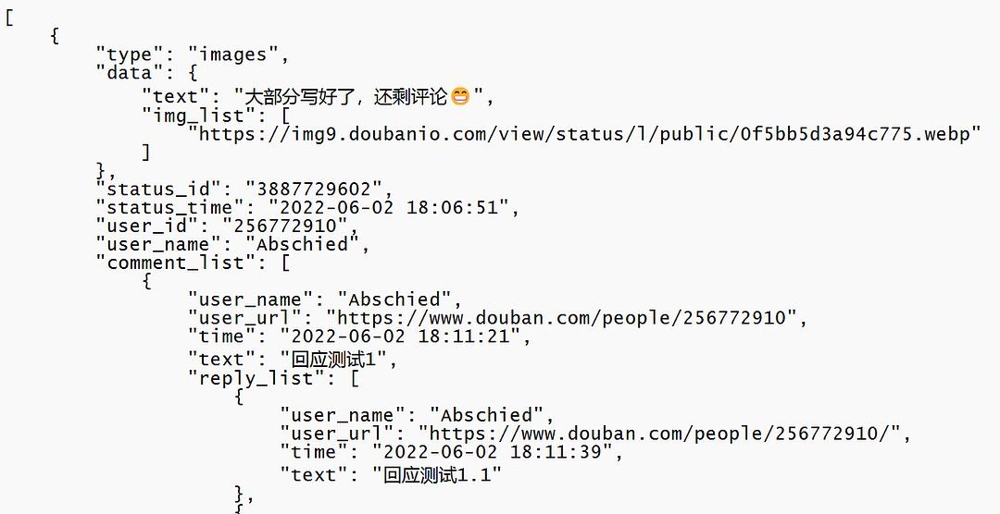
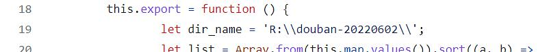
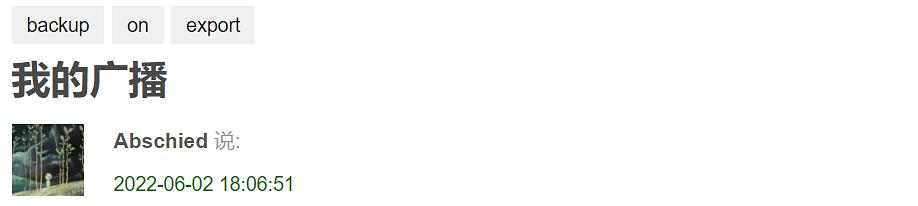

### 豆瓣广播半自动备份工具

---

“豆伴”的广播备份不太好用了，于是我自己花几天用Javascript写了一个简单的半自动广播导出工具。思路很简单，就是等广播页面在浏览器里加载出来后，用油猴脚本遍历dom树，把广播内容一条条提取出来，发送给在本地运行的一个Nodejs服务，最后用这个本地服务保存到文件中。

github链接： [douban-backup](https://github.com/hchenqi/JsTest/tree/main/douban-backup)

其中有两个油猴脚本，分别用来爬取statuses列表和单个status的评论；一个简单的Nodejs服务，依赖express模块用来和油猴脚本进行http通信，以及download模块下载广播中的图片。

导出效果见下图：

---

操作步骤：

浏览器安装：油猴插件 （Tampermonkey） 。

本机安装：Nodejs，带有npm包管理器。

将[douban-backup-server.js](https://github.com/hchenqi/JsTest/blob/main/douban-backup/douban-backup-server.js) 保存到一个特定的目录下，用命令提示符在该目录下执行npm install express以及npm install download。你会看到目录下多出了一个node_modules目录，里面都是外部依赖库的代码文件。然后用nodejs运行这个文件。

将[douban-backup-statuses.js](https://github.com/hchenqi/JsTest/blob/main/douban-backup/douban-backup-statuses.js) 和[douban-backup-comments.js](https://github.com/hchenqi/JsTest/blob/main/douban-backup/douban-backup-comments.js) 两个脚本导入油猴，这时当你打开广播页面，会出现下面的按钮：

在广播列表页，点击backup按钮，当前页面的广播将被提取并发送到后台服务程序中，如果某条广播含有评论，那么广播详情页将被自动打开。本页广播导出后，将自动切换到下一页。

off按钮表示自动导出为关闭，点一下会变成on，此后每当一个广播列表页面被加载，backup就会自动被点击，而后自动跳转到下一页、下下页，直到最后的空白页，从而将所有广播都将被导出。

点击export，后台程序将会把所有接收到的广播保存在一个固定的本地json文件中。你可以在此处修改[douban-backup-server.js](https://github.com/hchenqi/JsTest/blob/main/douban-backup/douban-backup-server.js) 中的dir_name为你期望的保存路径：

在广播详情页，也会出现这三个按钮，点击backup只会保存当前广播的评论，当前页面保存后会自动关闭。on和off还需要手动切换一次。export功能相同。

豆瓣的广播有不同种类，当前的备份工具只能备份其中几种，比如纯文字、带图片的文字、带文字的转发、书评、影评等，对于其它类型的广播暂不支持，且可能会报错终止。

如果你懂编程，应该可以很容易地对其进行修改。如果遇到问题可以联系我。
